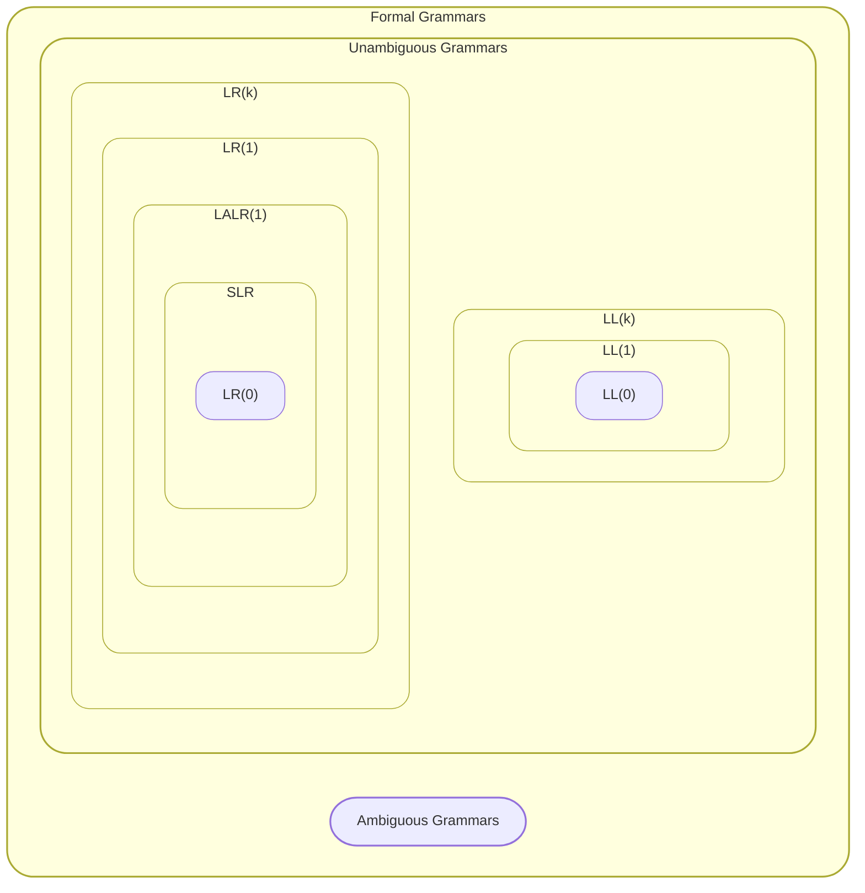
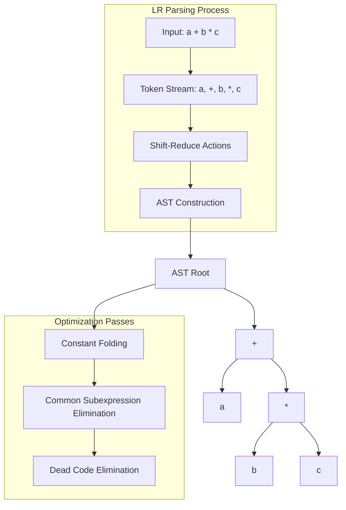

So, after a long time i'm back here to show what a studied these days.
This time i readed the [crafting intepreters](https://craftinginterpreters.com/) and [Tiger book (modern compiler implementation)](http://www.infouem.com.br/wp-content/uploads/2011/03/Modern-Compiler-Implementation-in-C.pdf) to get a better understanding of how compiler and languages works.

## Introduction
So far so good, started with the crafting interpreters which was really noob friendly (as clearly intended), i liked it that way because i knew close to nothing about the theme and read one chapter a day and after finishing a did the same with the Tiger book which was immensely harder and much more "academic" but even then it was delightful, there is still a LOT that i don't know but i have a slight idea of how to search about at least haha.

Also my goal with these posts is to synthetize the points and get a easier way to remember in later days.

The first part of the crafting interpreters is good for visualization as Nystrom says, the focus is in the concepts. The creation of the tree-walk interpreter which evaluates to the AST is funny if i can say, because it shows that there is nothing incredible going on, it's just what it is.

## Thoughs

### Lexical analysis
Jumping in the chapters we get the first contact with lexical analysis, which converts the raw code into "something"... There are some parts for this stage, and starting with the parser the one i liked the most is the implementation in the *Tiger* (gonna refer this way to be less repetitive), this one uses a parser generator (really like bison btw) Yacc, that just need a config file which makes everything direct to the point and simple, it converts the source code into [deterministic finite automata(DFA)](https://en.wikipedia.org/wiki/Deterministic_finite_automaton), also it's really important to read the theoretical part of this one, because it shows step by step the idea of deterministic *finite* executions.
- Important to say that in *CI* (crafting interpreters) this part is built by "hand" with recursive descent and the difference to the second part is the simplicity, the second integrates in a single-pass compiler (good [source](https://www.geeksforgeeks.org/single-pass-two-pass-and-multi-pass-compilers/) if you don't know what it is) and produces the tokens lazily (Like... on demand we could say).

### Parser

In *Tiger* the parser is made LR (It's important to say here that the book goes deeper in this topic, it shows detailed informations about LL, LR, SLR, LALR, GLR, and the implications of each one, in the end there is this representation)

After the LR parsing, the ASTs separate the syntactic structure which also enables multiple passes for otimization:

The *CI* part 1 does the parsing using recursive descent parser and directly integrate to the AST
